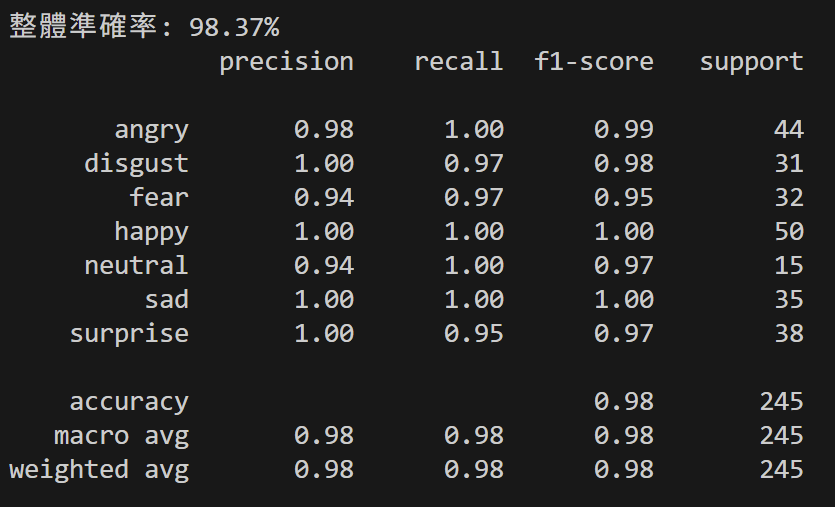
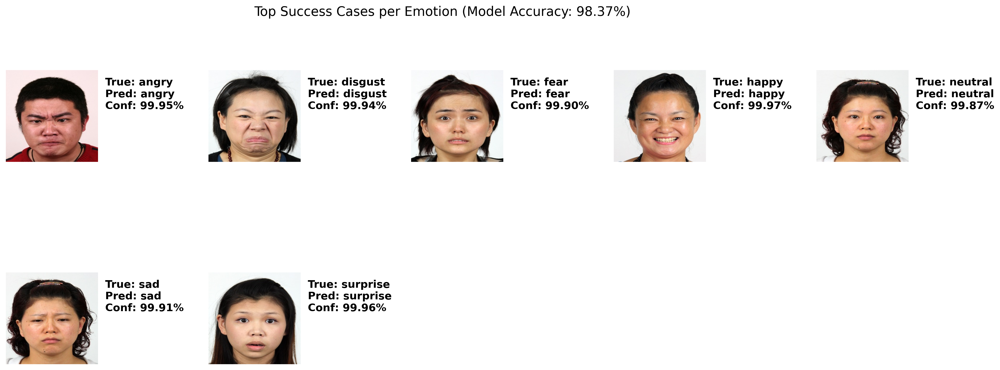
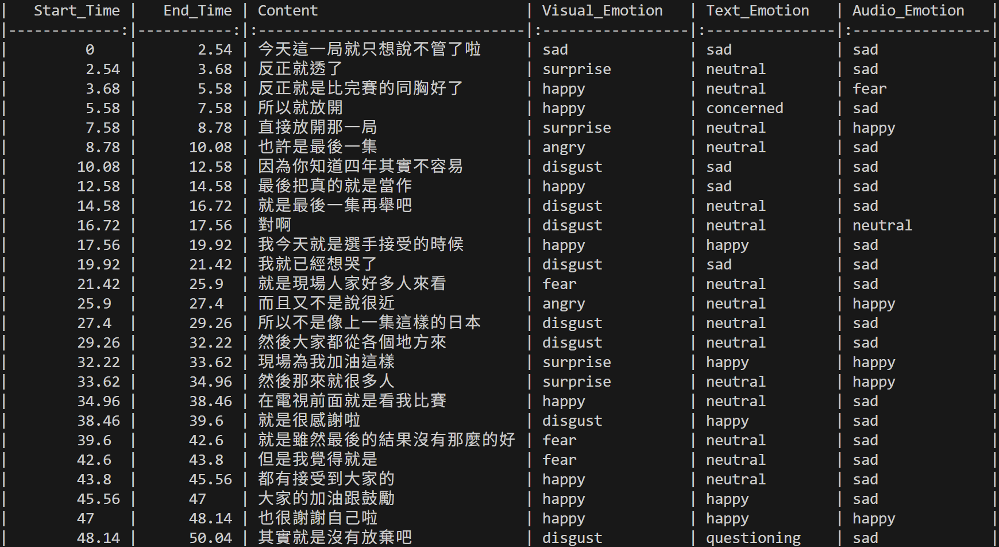

# Multimodal Emotion Recognition System (v2.0)

> **Current Version**: v2.0 (Visual + Audio + Text Integration)
> **Note**: (請在執行程式前，將資料集資料夾 faces_256x256/ 以及驗證影片 vlog.mp4 放置於專案根目錄。)

## 📌 Project Overview 
本專案旨在解決 **通用模型 (General Model)** 在特定族群（台灣人臉）上的 **領域偏移 (Domain Shift)** 問題，並進一步探討 **多模態 (Multimodal)** 在複雜情緒辨識中的必要性。。

原生的 DeepFace 模型在台灣人臉資料集上僅有 **40%** 的準確率。透過引入 SOTA 模型 **ConvNeXt Base** 並採用 **One-Stage 全解凍訓練 (Full Unfreeze)** 策略，成功將準確率提升至 **98.37%**，證明了針對特定場景進行微調 (Fine-tuning) 的必要性。
在 v2.0 版本中，更引入了 **語音 (Audio)** 與 **文字 (Text)** 模態，解決了單一視覺模型在「喜極而泣」等複雜情境下的誤判問題。。

Model | Modality | Accuracy / Performance |
| :--- | :--- | :--- |
| **Baseline (DeepFace)** | Visual (Face) | 40.00% (Zero-shot) |
| **Ours (ConvNeXt)** | Visual (Face) | **98.37%** (Fine-tuned) 🚀 |
| **Ours (Multimodal)** | **Visual + Audio + Text** | **Solved "Tears of Joy" Ambiguity** ✨ |

## 🚀 Key Features
### 1.Visual Model Optimization
* **SOTA Model**: 使用 **ConvNeXt Base** 整合原有的DeepFace模型，具備更強的特徵提取能力。
* **Training Strategy**: 
    * **One-Stage Training**: 全網路參數同步更新 (Full Unfreeze)。料集。
    * **Cosine Annealing**: 使用餘弦退火調整學習率 (1e-4 $\to$ 1e-6)。
    * **Strong Regularization**: 設定 `Weight Decay = 0.05` 與 `RandomErasing`，有效防止過擬合 (Overfitting)。
* **Robustness**: 在驗證集上達到 **98.37% Accuracy**，大幅改善了某些情緒的recall、precision。
* **Real-time Optimization**: 在 Live Demo 中引入 **時序平滑化 (Temporal Smoothing)**，解決預測標籤閃爍問題。

### 2. Multimodal Integration (New in v2.0)
* **Audio Analysis**: 使用 **HuBERT** (xmj2002/hubert-base-ch-speech-emotion-recognition) 捕捉語氣特徵（如哽咽、顫抖）。
* **Text Analysis**: 使用 **OpenAI Whisper** 進行語音轉文字 (STT)，結合 **XLM-Roberta** (Johnson8187/Chinese-Emotion) 進行語義分析。
* **Consistency Check**: 自動化對齊 Visual-Audio-Text 三種模態的時間軸，檢測情緒衝突。

## 📂 Project Structure
```text
.
├── requirements.txt     
├── README.md 
├── vlog.mp4 (需自行放入)
├── face_256x256 (需自行放入，資料夾應含有1232張照片)  
├── src/                 
│   ├── CV_image.py      
│   ├── CV_video.py 
│   ├── CV_live_demo.py 
│   └── CV_multimodel.py        
└── results/            
    ├── confusion_matrix.png
    ├── loss & accuracy_curve.png
    ├── error_analysis.png
    ├── success_cases.png
    ├── final_analysis_integrated.csv
    └── output_result.mp4
```

## ⚙️ Installation
建議使用 Python 3.8+ 環境：
```text
Bash

# 安裝必要套件
pip install -r requirements.txt
(註：若有 GPU，請確保 PyTorch 版本支援 CUDA 以加速訓練)
```

## 💻 Usage
1. 訓練與評估 (Training & Evaluation)
執行此指令可重新訓練模型，產生loss & accuracy curve、confusion matrix、err analysis與Success Cases的結果圖。
```text
Bash

python src/CV_image.py
```
輸出位置: results/

2. 即時偵測 (Live Demo)
啟動 Webcam 進行即時情緒辨識，包含防閃爍 (Temporal Smoothing) 功能。
```text
Bash

python src/CV_live_demo.py
```
3. 影片分析 (Video Analysis)
針對指定的影片檔（如郭婞淳訪談 vlog.mp4）進行情緒分析。
```text
Bash

python src/CV_video.py
```
輸入：預設讀取根目錄下的 vlog.mp4。

輸出：分析後的影片將存為 results/output_result.mp4。

4. 多模態整合分析(Multimodel analysis)
執行此指令可一次完成視覺辨識、語音轉錄、聲學分析與語義分析，並輸出 CSV 報表與標註影片。
```text
Bash

python src/CV_multimodel.py
```
輸入影片：預設讀取根目錄下的 vlog.mp4。

輸出影片：分析後的影片將存為 results/output_result.mp4。
輸出報告：分析後的整合報告將存為 results/final_analysis_integrated.csv。

## 📊 Results & Analysis
1.Model Performance:
Accuracy = 98.37% (大幅優於 Baseline 40% (only DeepFace))


2.Loss & Accuracy Curve: 
從圖表中可見，訓練曲線（藍色）與驗證曲線（橘色）呈現同步收斂的趨勢，兩者之間沒有出現明顯的差距（Divergence）。這證明了設定的 `Weight Decay=0.05` 成功抑制了模型過擬合 (Overfitting) 的現象。


3.混淆矩陣 (Confusion Matrix): 
模型在特徵明顯的離散情緒（如 `Happy`, `Sad`, `Angry`）上展現了近乎完美的分類能力。值得注意的是，通常被視為最難辨識的 Fear 類別，其 Recall (召回率) 達到了 **97%**，這歸功於強力的 **資料增強 (Data Augmentaion)** 策略。


4.錯誤案例分析 (Error Analysis):
針對剩餘 **1.63%** 的預測錯誤案例進行了深入分析。結果發現，絕大多數的錯誤源於 **標註雜訊 (Label Noise)** 或 **模糊不清的表情 (Ambiguous Expressions)**（例如一張臉同時具備驚訝與恐懼的特徵）。在這些案例中，模型的預測機率通常呈現分散狀態（High Entropy），顯示出其對該影像的不確定性。


5.成功案例展示 (Success Cases):
模型在各個類別的高信心預測展示。


## Case Study: Tears of Joy (郭婞淳影片分析)
選用了奧運金牌得主郭婞淳的 Vlog 影片 `(vlog.mp4)` 進行多模態一致性分析，以評估模型在 **動態真實場景** 中的泛化能力。

### 1. 觀察現象 (The Phenomenon)
在影片中，當選手激動地說出感謝時，單一模態模型出現了顯著的衝突：

Visual: 誤判為 Disgust/Fear (因皺鼻與哭泣表情)。
Audio: 誤判為 Sad (因聲音哽咽顫抖)。
Text: 正確判讀為 Happy (語義包含「感謝」、「接受」)。


### 2. 關鍵洞察 (Critical Insight)
* **視覺特徵的歧義性 (Visual Ambiguity)**：
    當人物在激動說話或強忍淚水時，面部伴隨的 **「皺鼻 (Nose Wrinkling)」** 與 **「上唇上提 (Lip Raising)」** 動作，在幾何像素特徵上與「厭惡」表情高度重疊，導致模型誤判。
* **單一標籤的限制 (Single-Label Limitation)**：
    現有的 Cross-Entropy 損失函數強迫模型進行「互斥」分類。面對「喜極而泣」這種 **複合情緒 (Compound Emotions)**，模型無法同時輸出 `Happy` 與 `Sad`，只能被迫選擇特徵較為強烈的負面情緒。

### 3. 結論 (Conclusion)
    本實驗證實了 Text (文字) 模態在複雜情緒辨識中扮演了 「語義錨點 (Semantic Anchor)」 的關鍵角色。

Visual & Audio 傾向捕捉 「生理反應」 (Physiological Response)，例如哭泣的臉與顫抖的聲音，因此容易將「激動的喜悅」誤判為負面情緒（如 Sad 或 Fear）。
Text 則能直接反映 「心理意圖」 (Cognitive Intent)，在 Visual/Audio 失準時提供了正確的情緒定位。
Future Work: 未來的改進方向可引入 Attention Mechanism (注意力機制) 來自動分配不同模態的權重，或定義如「喜極而泣 (Tears of Joy)」這類的 複合情緒標籤。。
