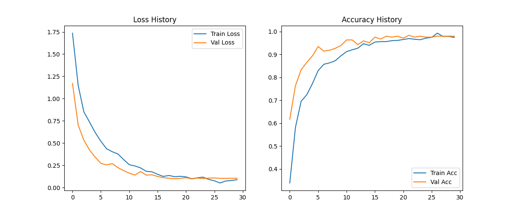
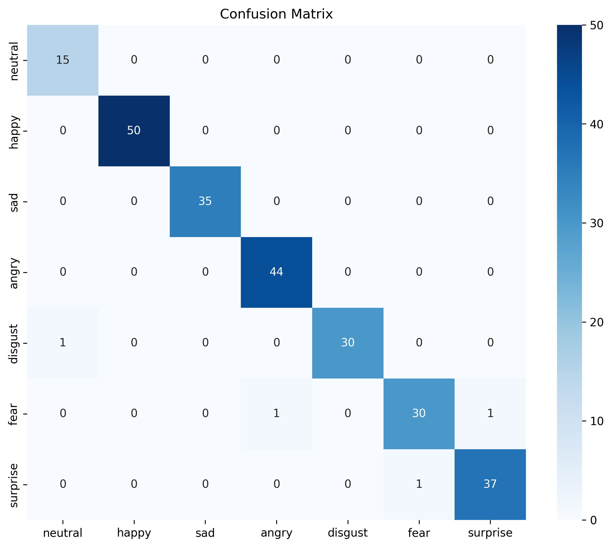
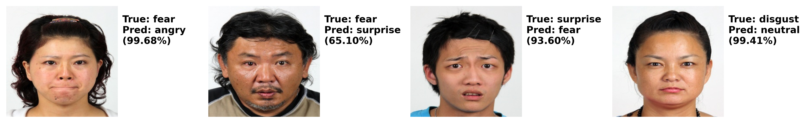

# Computer-Vision

## 📌 Project Overview 
本專案旨在解決 **通用模型 (General Model)** 在特定族群（台灣人臉）上的 **領域偏移 (Domain Shift)** 問題。

原生的 DeepFace 模型在台灣人臉資料集上僅有 **40%** 的準確率。透過引入 SOTA 模型 **ConvNeXt Base** 並採用 **One-Stage 全解凍訓練 (Full Unfreeze)** 策略，我成功將準確率提升至 **98.37%**，證明了針對特定場景進行微調 (Fine-tuning) 的必要性。

## 🚀 Key Features
* **SOTA Model**: 使用 **ConvNeXt Base** 整合原有的DeepFace模型，具備更強的特徵提取能力。
* **Training Strategy**: 
    * **One-Stage Training**: 不凍結權重，全網路參數同步更新，讓大模型完全適應小資料集。
    * **Cosine Annealing**: 使用餘弦退火調整學習率 (1e-4 $\to$ 1e-6)，精確收斂。
    * **Strong Regularization**: 設定 `Weight Decay = 0.05` 與 `RandomErasing`，有效防止過擬合 (Overfitting)。
* **Robustness**: 在驗證集上達到 **98.37% Accuracy**，大幅改善了某些情緒的recall、precision。

## 📂 Project Structure
```text
.
├── requirements.txt     
├── README.md            
├── src/                 
│   ├── CV_image.py      
│   ├── CV_video.py      
└── results/            
    ├── confusion_matrix.png
    ├── loss & accuracy_curve.png
    ├── error_analysis.png
    └── output_result.mp4
```

## ⚙️ Installation
建議使用 Python 3.8+ 環境：
```text
Bash

# 安裝必要套件
pip install -r requirements.txt
(註：若有 GPU，請確保 PyTorch 版本支援 CUDA 以加速訓練)
```

## 💻 Usage
1. 訓練與評估 (Training & Evaluation)
執行此指令可重新訓練模型，產生loss & accuracy curve、confusion matrix與err analysis的結果圖。接著儲存至 results/。
```text
Bash

python src/CV_image.py
```

2. 影片分析 (Video Analysis)
針對指定的影片檔（如郭婞淳訪談 vlog.mp4）進行情緒分析。
```text
Bash

python src/CV_video.py
```
輸入：預設讀取根目錄下的 vlog.mp4。

輸出：分析後的影片將存為 results/output_result.mp4。


## 📊 Results & Analysis
1.Model Performance:
Accuracy = 98.37% (大幅優於 Baseline 40% (only DeepFace))

2.Loss & Accuracy Curve: 
從圖表中可見，訓練曲線（藍色）與驗證曲線（橘色）呈現同步收斂的趨勢，兩者之間沒有出現明顯的差距（Divergence）。這證明了我設定的 `Weight Decay=0.05` 成功抑制了模型過擬合 (Overfitting) 的現象。


3.混淆矩陣 (Confusion Matrix): 
模型在特徵明顯的離散情緒（如 `Happy`, `Sad`, `Angry`）上展現了近乎完美的分類能力。值得注意的是，通常被視為最難辨識的 Fear 類別，其 Recall (召回率) 達到了 **94%**，這歸功於強力的 **資料增強 (Data Augmentaion)** 策略。


4.錯誤案例分析 (Error Analysis):
我針對剩餘 **1.63%** 的預測錯誤案例進行了深入分析。結果發現，絕大多數的錯誤源於 **標註雜訊 (Label Noise)** 或 **模糊不清的表情 (Ambiguous Expressions)**（例如一張臉同時具備驚訝與恐懼的特徵）。在這些案例中，模型的預測機率通常呈現分散狀態（High Entropy），顯示出其對該影像的不確定性。


## Case Study: Tears of Joy (郭婞淳影片分析)
我選用了奧運金牌得主郭婞淳的 Vlog 影片進行測試，以評估模型在 **動態真實場景** 中的泛化能力。

### 1. 觀察現象 (The Phenomenon)
在影片中「喜極而泣」的片段，模型傾向於將情緒持續歸類為 **`Disgust` (厭惡)** 、 **`Fear` (恐懼)** 或 **`Sad` (悲傷)**，而非預期的 **`Happy` (開心)**。

### 2. 關鍵洞察 (Critical Insight)
* **視覺特徵的歧義性 (Visual Ambiguity)**：
    當人物在激動說話或強忍淚水時，面部伴隨的 **「皺鼻 (Nose Wrinkling)」** 與 **「上唇上提 (Lip Raising)」** 動作，在幾何像素特徵上與「厭惡」表情高度重疊，導致模型誤判。
* **單一標籤的限制 (Single-Label Limitation)**：
    現有的 Cross-Entropy 損失函數強迫模型進行「互斥」分類。面對「喜極而泣」這種 **複合情緒 (Compound Emotions)**，模型無法同時輸出 `Happy` 與 `Sad`，只能被迫選擇特徵較為強烈的負面情緒。
* **結論**：
    這凸顯了現有 7 分類模型在處理複雜人類情感時的局限性。未來的改進方向可引入 **多標籤分類 (Multi-Label Classification)** 或定義如「驚喜 (Happily Surprised) = 驚喜 + 開心」等複合類別。

*(分析結果影片已儲存於 `results/vlog_output.mp4`)*